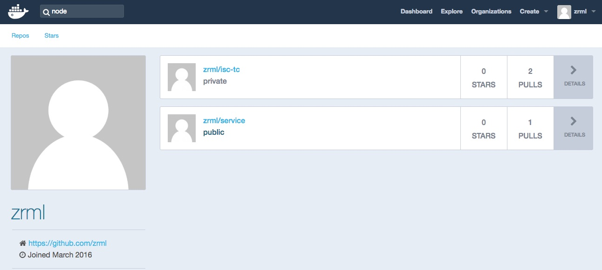
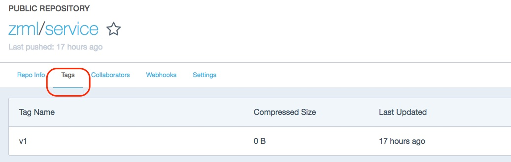

# Building your own Container

There are 2 ways to create a container image.
Points (a) and (b) below allows us to test these 2 methodologies


**a)**
run a container,
stop it,
commit the changes done to a new one.

Let's try it out:
- we will run a container and jump in the internal shell
- we will then create a file
- then exit the container
- and create a new **container image**, with our file in it, from the one that was just stopped.

Commands to execute at the OS command prompt
```
$ docker run -i -t busybox sh           // i = interactive; t = pseudo tty

# touch myfile.test                     // create an empty file

# ls -l                                 // verify the file exists

# exit

$ docker ps                             // No container available

$ docker ps -a                          // I can see the exited/stopped container and its <CONTAINER_ID>

$ docker commit <CONTAINER_ID> <MY-REPO>:<MY-TAG>
// replace <VARS> with your specific container ID and
// a repo name and tag of your liking like fred:v1 for example (lower case only)

$ docker images                         
// verify that your new container image is available in your local repo
```

---


**b)**
The real deal is via a build process that can be automated.
The build process starts with the declaration state in a *Dockerfile* (no extension needed). In the Dockerfile we define what we want our container to have in it. The build process allows us to satisfy any application dependencies at BUILD time (vs RUN time).

We will build an app and package it up in a container that we can then run anywhere.

1. **Let's create an App** - 
Copy & paste the following code in a file called server.js (it's javascript for Node.js but it could have been as easily GO, Python, etc.)
```
var http = require('http');
var handleRequest = function(request, response) {
  response.writeHead(200);
  response.end("Hello World!");
}
var www = http.createServer(handleRequest);
www.listen(8080);
```

or simply copy/paste from Github or clone this lab so that at the end you have a *server.js* file.

2. **Node.js** -  
If you have Node.js installed test your app or
install Node.js and test it :)
https://nodejs.org/en/download/

Let's launch the app via
```
$ node server.js
```

and verify it works with a browser or another shell with 
```
$ curl http://127.0.0.1:8080
```

You can now stop Node.js with a CTRL-C on the terminal where you launched it.


3. **Creating the Container Definition** - 
Instead of running a container and copying things in the container and committing it to a new container image, as in the previous exercise, we will automate its creation via the Docker build command and simply provide the declaration of what we want in the container and what should be running.

The following is the container declaration to copy & paste in a file called *Dockerfile*.
```
# deriving our container from a prebuilt one
FROM node:10-slim

COPY server.js .

EXPOSE 8080

# run the following default command when container is run
CMD node server.js
```
You'll have noticed that we did not install Node.js but just inherited or derived our image FROM an existing one.

Please try a quick lookup of available Node.js containers via
```
$ docker search node
```

What do you see?

For this exercise, again you can simply copy/paste from this Github page or clone this lab so that at the end you have a Dockerfile file as per example.


4. **Building the Container** - 
After the definition in the Dockerfile, let's build it
    * we supply the -t flag for tagging it and
    * don't forget that last "." dot, meaning, find a Dockerfile in this directory
```
$ docker build -t service:v1 .
```

After the build check that effectively you have a new container image
```
$ docker images
```

also investigate all the container layers via
```
$ docker history service:v1
```

5. **Running the new Container** - 
Let's run the container
but before we do that let's do some housekeeping just in case
* First, list all running containers
```
$ docker ps
```

* Second, list all stopped containers
```
$ docker ps -a
```

* Third, stop all running containers and remove all stopped containers too as they still hold resources like open sockets etc.
```
$ docker stop $(docker ps -aq)

$ docker rm $(docker ps -aq)
```

* Fourth, Now that we have been diligent with our housekeeping, we can run our app with the following command
    - -d stands for detach; the container will run in the background freeing your shell for other work
    - -p or --publish for TCP socket publishing; the first value is the host exposed port; the second value, after the ":", is the value of the port inside the container.
```
$ docker run -d --name myservice -p 8080:8080 service:v1
```

* Fifth, now check that it is running and that we can access our service at the http end-point
```
$ docker ps
```

What details do you see?

```
$ curl http://127.0.0.1:8080
or
via your browser
```

You might as well quickly monitor your container, just in case there is a heavy workload coming & you need to spin up another one :-o
```
$ docker stats myservice
```


* Stop & remove the container
    * please note how the simple 'ps' command shows you all *running* containers
    * while the 'ps -a' shows you all *running and stopped* containers
```
$ docker stop myservice

$ docker ps

$ docker ps -a

$ docker rm myservice
```

6. **Push it** - 
Now that we have the app service packaged up, let's push it to our personal container repository for sharing it or pulling it from a cloud node.
We will use our individual user accounts on Docker Hub and push our *service:v1* container image to that account

* make sure you're logged in via
```
$ docker login -u=<USERNAME>

or to make sure we address the right registry -although it's the default, try
$ docker login docker.io -u <USERNAME> 
```

* Move the local container image to the personal registry. Remember that by default container images pushed to Docker Hub are public. You can have private registry but you have to pay.
* A simple docker push will most probably fail as the container must be named according to your registry.
    * at present we have a simple *service:v1*
    * The individual account on Docker Hub contains our Docker ID so we need to rename or re-tag our image first before Docker knows where to upload it to
```
$ docker tag service:v1 <MY_DOCKER_ID_NAME>/service:v1
```

Now, after the retagging you can push it
```
$ docker push <MY_DOCKER_ID_NAME>/service:v1
```

Verify that it is available for consumption in Docker Hub.
Point your browser to
```
https://hub.docker.com/u/<MY_DOCKER_ID_NAME>
```


Example of myservice in the Docker Hub container registry




Viewing the Tags for that same container image




7. **Use it in the cloud** -
Extra bonus: to close the circle let's make use of that same artefact or container in a public cloud.
    * Use one of the students credentials
    * Connect to GCP and create a a compute-node instance (Compute Engine --> VM instances)
    * Name it
	- <my-name-initials>-instance
    * For the base OS or *Boot disk* 
        - select one of Google *Container Optimized OS* image (so we don't have to install Docker)
    * Select "Allow HTTP traffic" so that we have port 80 available
        - the default instance give us a public IP so we are OK
    * Default everything else
    * Once the instance is up and running check Docker is installed with any command you know
    * Run your container :)
    	- You'll need to log in to the registry (Docker Hub where you pushed it)
    	- Make sure the container is marked as public (in Docker Hub - Settings) if it does not work
    	- Run it! Don't pull it.
    	

```
$ docker run -d -p 80:8080 <MY_DOCKER_ID_NAME>/service:v1
```

Now test it & verify it with all the commands you know
- docker ps, history, stats, inspect, etc.
- curl http://localhost:80
- http://<public_ip>


---

Congrats! :tada: 
You're now a container expert that can pull, run, build & push containers and 
use the same operational commands on most modern platforms like:
* x86-64 Linux (Ubuntu, RHEL, SUSE, Debian, Fedora, etc.)
* ARM (Rasperry PI, Android, Arduino, microcontrollers, etc.)
* Windows
* IBM 
	- POWER & 
	- Z series mainframes

	
