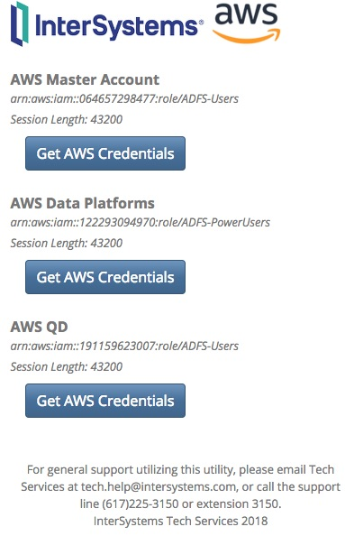
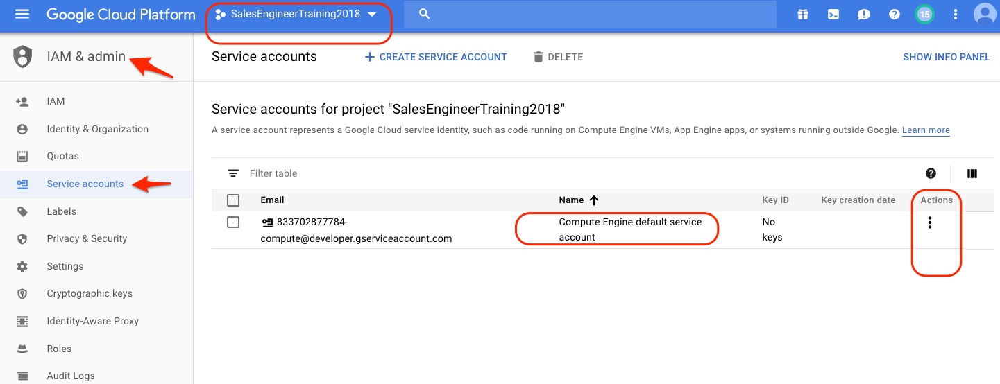
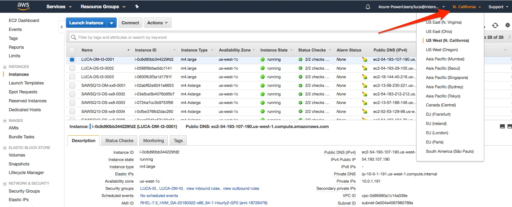
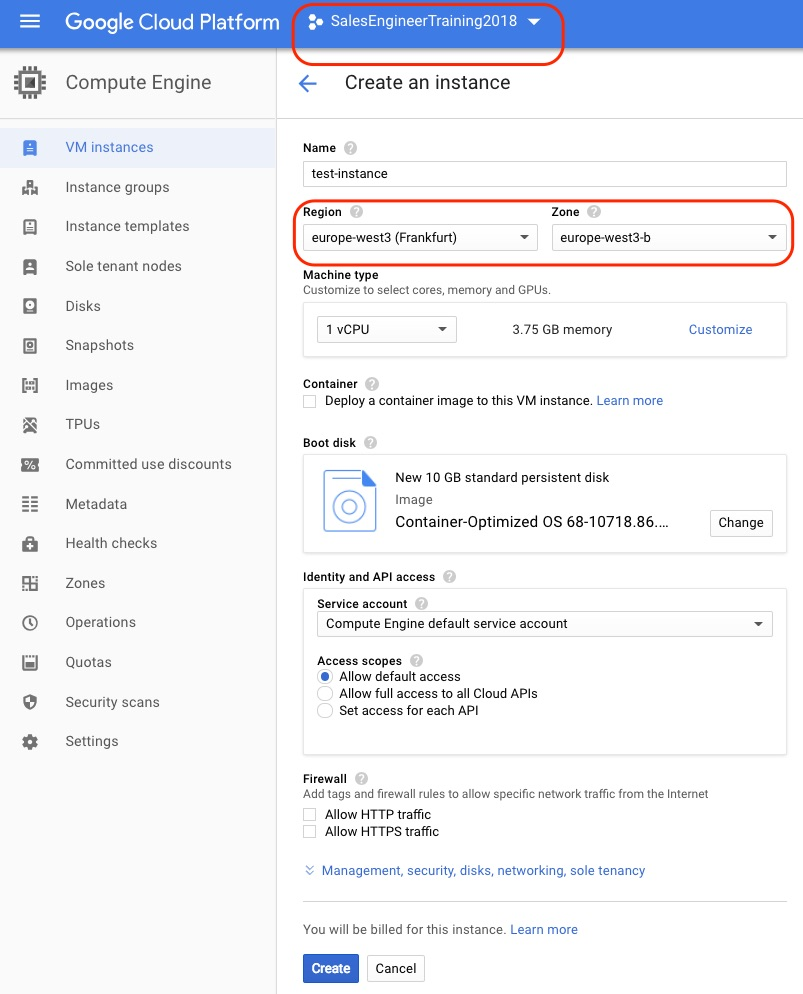

# InterSystems Cloud Manager - Environment Setup

1. **Pull InterSystems Cloud Manager (ICM)**
    * Just in case you're coming directly to this lab: everything is pre-packaged for you in a container.
    * You have nothing to install and configure of the following technology list; just pull the container as per command below, and you'll be able to setup a working environment with all the technolgies already packaged and configured for you
        * JVM
        * Terraforms
        * environment setup
        * samples
```
$ docker pull intersystems/icm:2018.2...
```
---

2. **ICM Automates the Environment**
The easiest way to get started with ICM is by using the /Samples/* in the container, as we saw in Lab0. However, there are a couple of issues that can be annoying and uncomfortable for some like (a) using vi|nano|emcas inside the contianer and (b) loosing all your settings when exiting the container environment.
Many issues with ICM, like with anything "cloud", revolve around the corollary security setup needed, the correct privileges of the account for using IaaS resources, latency & timeouts, etc. We must think of it (the cloud env) as an hostile environment. Everything comes to us early in the cloud and retrofitting things (especially security) is usually thougher. We do not control a cloud environment like we control and manage our latop. We are merely users of resources and we must adhere to the APIs at our disposal. We have tried to make things simpler and welcome your feedback. ICM & ISC help us in several ways. Let's get started:
    1. **Credentials** for the IaaS providers
        1. *AWS:* [link to corporate credentials explained](https://usconfluence.iscinternal.com/display/IAWS/AWS+Credentials+Utility+for+ICM+and+AWS+CLI); credentials are valid for 12 hours. There is a further link to select and here is the [direct link](https://awscredentials.intersystems.com)
            * input your ISC SSO crendentials
            * click the "Get AWS Credentials" button from the "AWS Data Platform" central section
            * 
            * save those credentials in a file
        2. *GCP*
            * Connect to the Goocle cloud console: [https://console.cloud.google.com/](https://console.cloud.google.com/)
            * Use your student ID
            * Switch to the temporary GCP Project: SalesEngineerTraining2018
            * Navigate to *"IAM & admin"* and select *"Service accounts"*
            * Identify the *"Compute Engine default service account"* and under the *"Action"* column of the same raw, click the 3 dots "options" symbol and select *"Create key"*
            * 
            * Chose Key type "JSON* and then click *"Create"* for saving your credentials file
        3. *Azure*
            * ...
    3. **ssh keys**
        1. ICM can quickly create & use temporary keys for you by running a script
    5. **TLS certificates**
        1.  ICM can quickly create & use temporary certs for you by running a script
    7. **InterSystems license key**
        1. ICM can quickly prepare a key by running a script (be VPN'd in)


[ICM internal resources (a)ICM Getting started Guide and (b)ICM Functional Specification](https://usconfluence.iscinternal.com/display/TBD/Containers+Port#ContainersPort-ICMResources)
    
---    

3. **Reusable Script Preparation** -
    1. Make sure you have your credentials for the selected public provider and that they are saved in a file. You'll have to tell ICM to grab that file.
    2. Don't worry about
        1. ssh keys
        2. TLS certs &
        3. InterSystems IRIS key - ICM takes care of that for demo & POC efforts
    3. Create a working "cloud" directory. Let's call it 'cloud' and cd into it. For example
        * ```$ mkdir $HOME/cloud``` and
        * ```$ cd cloud```
    4. Create a subdir of the cloud directory called "key" that we will use later for all *security* related files
        * ```$ mkdir cloud```
    5. Copy your *credentials file* to this cloud/key  working directory; for example
        * ```$ cp $HOME/Download/aws.credentials $HOME/cloud/key/```
    6. ICM can provision licenses keys or if you want to use yours or test them just copy the *InterSystems IRIS license key* in the same cloud/key directory as above
    7. let's *prepare a script* to launch ICM so that we don't have to remember all the details of the docker command. Use *vi|vim|nano|emcas|editor-of-choice* and create a bash or powershell script called *icm.sh* and copy/paste the following code.

    ```
    #!/bin/bash
    clear

    # extract the basename of the full PATH
    DIR2MOUNT=$(basename $(pwd))

    # we are mounting the PWD or $HOME/cloud (in our example) inside the container 
    # at the root level.
    # IOW we will have '/cloud' in the container 
    # with all the files found at the host level in $HOME/cloud
    #
    docker run --name icm -it -v $PWD:/$DIR2MOUNT --cap-add SYS_TIME intersystems/icm:2018.2.0-dev

    printf "\nExited icm container\n"
    printf "\nRemoving icm container...\nContainer removed:  "
    docker rm icm
    ```
    
    8.  make sure that the ICM container *version* is the one you want
    9.  make sure the script can be executed
        a.  ```$ chmod 755 icm.sh```
    10. run it
        * ```$ ./icm.sh``` 
    11. You should be inside the ICM container ready to run the ICM commands
        * Check that your cloud directory was mounted ```ls -l```
        * cd into it to verify that the content of the host dir is all there and that ICM responds
        ```
        # cd /cloud
        # ls -l
        # icm
        ```
    12. :+1: Congrats! ICM is ready to provision your cloud infrastructure and your script can be used again and again.
 
---

4. **Security Keys & Samples** -
    1. Instead of starting from scratch with our definitions we will *leverage the samples* provided, so, run the following command to copy & verify the ICM declarative definitions we want to use
    ```
    # cd /cloud
    # cp /Samples/AWS/*.json .        // or cp /Samples/GCP/*.json if using Google Cloud
    # ls -l
    ```
    3. Create temporary *ssh keys* and store them in ./key 
        * ```# keygenSSH.sh ./key/ ```
    5. Create temporary TLS certificates and again let's store them away in the ./key directory
        * ```# keygenTLS.sh ./key/ ```
    7. Create temporary InterSystems IRIS key files (make sure you're VPN'd in) and copy them in the same /cloud/key location
    ```
    # getLicense.sh
    # cp /Samples/license/* ./key/
    # ls -l ./key
    ```
    9. FYI all executables and scripts provided by ICM are in your path and can be found in */ICM/bin*
    10. You are all set with the security part.

---


5. **Infrastructure Definition**
    1. It's time to make sure our declarative JSON definitions are what we want to carve out of those clouds, so, with your favourite editor, open and edit the **defaults.json** and adjust names and paths to your local resources:
        * Change the UPPERCASE values (Label & DockerUsername) 
        * Review the Credentials file location value
        * Add a password for all your IRIS cluster instances (ISCPassword)
        * Decide which IaaS Region & Zone you want to run your cluster in
            - AWS: [AWS Regions](https://aws.amazon.com/about-aws/global-infrastructure/)
                - 
            - GCP: [GCP Regions](https://cloud.google.com/compute/docs/regions-zones/)
                - 
        * Example of *defaults.json*:
        ```
        {
        "Provider": "AWS",
        "Label": "MYINITIALS",
        "Tag": "t1",
        "DataVolumeSize": "10",
        "SSHUser": "ec2-user",
        "SSHPublicKey": "/cloud/key/insecure-ssh2.pub",
        "SSHPrivateKey": "/cloud/key/insecure",
        "DockerImage": "intersystems/iris:2018.2.0-dev",
        "DockerUsername": "MY-DOCKER_HUB_ID",
        "DockerPassword": "",
        "TLSKeyDir": "/cloud/key",
        "LicenseDir": "/cloud/key/",
        "Region": "us-west-1",
        "Zone": "us-west-1c",
        "AMI": "ami-18726478",
        "InstanceType": "m4.large",
        "Credentials": "./aws.credentials",
        "SystemMode": "TEST",
        "ISCPassword": "",
        "Namespace": "DB",
        "Mirror": "false"
        }
        ```
    2. Consult & review your *default.json* with the colleague next to you...

---

6. **IRIS Cluster Definition**
    1. While the *defaults.json* file is mostly concerned with the infrastructure side, the **definitions.json** specifies the type of InterSystems IRIS cluster we want. For this first run we are happy to just have this simple definition of 1xDM and 2xDS. There is nothing to do for you. Lucky guy :)
    ```
    [
      {
	    "Role": "DM",
	    "Count": "1",
	    "LicenseKey": "ubuntu-sharding-iris.key"
      },
      {
	    "Role": "DS",
	    "Count": "2",
	    "StartCount": "2",
	    "LicenseKey": "ubuntu-sharding-iris.key"
      }
    ]
    ```
    2. for the adventurous: make sure you [read the documentation](https://docs.intersystems.com/irislatest/csp/docbook/DocBook.UI.Page.cls?KEY=GICM) before getting frustrated :)
---

7. **Run the Provisioning**
    1. From the /cloud directory issue the simple command
    ```
    # icm provision
    ```
    2. if you are interested in having more feedback you can use the ```--verbose``` flag
    3. if you want to measure the IaaS timing you could prepend a time command as in 
        * ```$ time icm provision```
    4. Check via the IaaS (AWS, GCP, Azure) portal the created resources

---


8. **Run the Deployment**
    1. Run the service deployment command
    ```
    # icm run
    ```
    2. You're done!

---

Congrats! :+1: You now have a properly setup environment on your local workstatio where you can leverage your preferred tools for configuring & using InterSystems Cloud Manager definitions files, save them together with keys, certificates, credentials and other scripts in source-control systems, vaults, etc. :sparkles: :tada:

In the next lab we will see all the remaining ICM commands.
