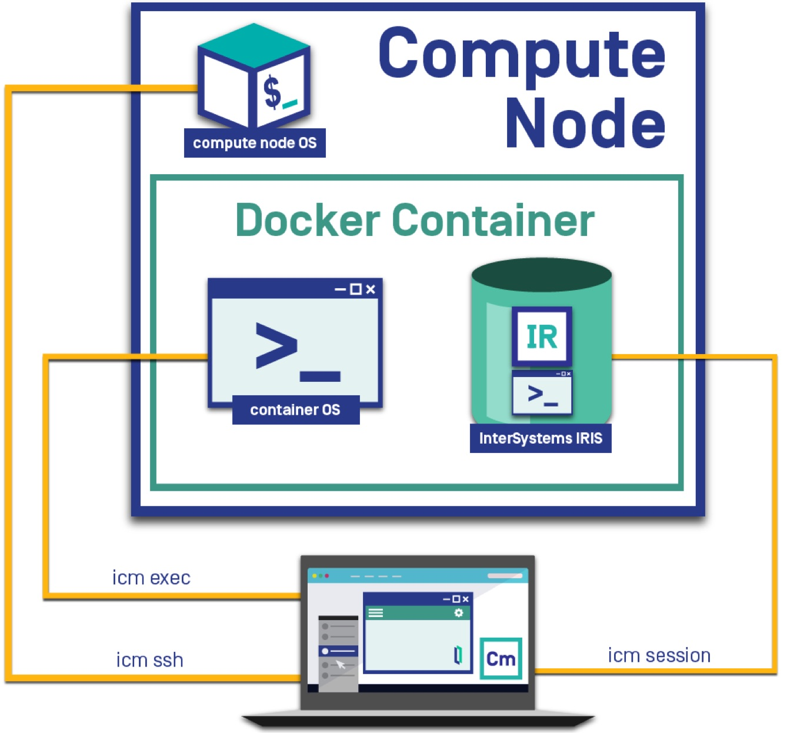

## InterSystems Cloud Manager Commands

1. **InterSystems Cloud Manager (ICM) Verification Commands**
    1. What are the compute-nodes provisioned?
    	* ```# icm inventory```
    2. What is the status of the IRIS instances?
    	* ```# icm ps -container iris```
    	* ```# icm ps```
    3. What is the free storage available on all my data disks?
    	* ```# icm ssh -command "df -h"  ```
    4. What are the InterSystems IRIS versions running in the cluster?
    	* ```# icm session -command 'write $ZV'  ```

---

2. **ICM Interactive Direct Connectivity Options**
Although the benefits of working with an artefact that was built and that just need to be run is evident (distiction between BUILD and RUN phase in DevOps), at times it is necessary to perform some operations on a live system without the repprovisioning of a container. Or it could be the case of a customer that needs to further configure something after an InterSystems IRIS cluster soluiton is provisioned-and-configured or that somebody may simply want to double check thing. How do you run something interactively? InterSystems Cloud Manager allows to connect to all the available abstration layers or components with the following commands 
	1. ```# icm ssh -interactive -machine LR-DM-t3-0001```
	2. ```# icm exec -interactive -machine LR-DM-t3-0001```
	3. ```# icm session -interactive -role DM -namespace DB```

3. **ICM and Copy**
icm cp
The icm cp command copies a local file or directory on the specified node into the specified container. The command syntax is as follows:
 icm cp -localPath local-path [-remotePath remote-path]
Both localPath and remotePath can be either files or directories. If both are directories, the contents of the local directory are recursively copied; if you want the directory itself to be copied, include it in remotePath.
The remotePath argument is optional and if omitted defaults to /tmp; if remotePath is a directory, it must contain a trailing forward slash (/), or it will be assumed to be a file. You can use the -container option to copy to a container other than the default iris.
Note:
See also the icm scp command, which securely copies a file or directory from the local ICM container to the specified host OS.

---

4. **ICM Supporting Developers**
What if a developers needs to check some data in a table or in a global?
	1. ```# icm sql -command "select * from T1 order by name" -role DM -namespace DB```
	2. ```# icm session ```
		* try out a *ZW ^SYS("UCI"* command in %SYS, for example...

---

5. **Cloud Cluster Information**
What if I wanted to check out all the public DNS names of the cluster or the data mount points of the filesystems or the sockets that are open so that I can *programmatically* do something else with it?
	1. As ICM provisions, deploys and configures the cluster, it creates and maintains a simple *instances.json* file. View the file and see the information it contains:
		* ```# more instances.json```
	2. What if I want to run, stop anything against a container? ICM has got you covered with *icm docker*:
		* ```icm docker -command "stats --no-stream" -machine <machine_id>```

--- 

6. **Responsible ICM**
We all need to be cost conscious. ICM allows us to quickly unprovision the whole IRIS cluster and remove all infrastructure resources previously provisioned so not to incur unnecessary cost. We need to be aware that some state information is kept in a directory called ICM-<id> where logs and errors information are kept.
	1. ```# icm unprovision -stateDir ./ICM-23782672629127```
	2. Please note the *-cleanUp* flag 
	3. and the *-force* flag
	4. [ICM unprovision documentation](https://docs.intersystems.com/irislatest/csp/docbook/DocBook.UI.Page.cls?KEY=GICM_using#GICM_using_unprovision)

---

Congrats again! :tada: You are ready to be productice with InterSystems Cloud Manager :rocket: